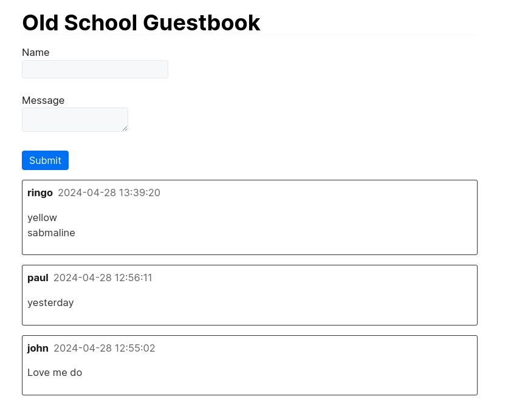

# phel-old-school-guestbook

Simple old school guestbook.

This repository is a very primitive project of a small bulletin board Phel-lang application using mysql for storage.

Using Docker, you can prepare an environment that runs PHP and Phel-lang using apache and mysql.

## Usage

Build and launch the Docker image.
It will take some time to start up.

```bash
docker compose build --build-arg uid="$(id -u)"
docker compose up -d
```

Install dependent libraries.

```bash
docker compose exec php bash
www-data@6298268e0b08:~/html$ composer install

```

In your browser, open http://localhost:3333/



### Compile phel code to PHP code

By default, phel code is compiled and executed for each request. Compiling phel code to PHP code will make it run faster.

```bash
docker compose exec php bash
www-data@6298268e0b08:~/html$ vendor/bin/phel build
```


## Development

Start bash in the docker php container.

```bash
docker compose up -d
docker compose exec php bash
```
